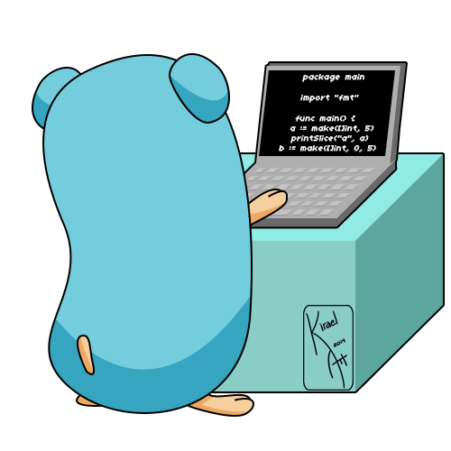

# 💫 About Me:
>🔭 Welcome to my GitHub page!
>
<br>  I'm a dynamic backend developer with a foundation in computer science, passionate about Django and Go.
<br>  Explore my repositories to see my clean and efficient coding style. **Let's connect and build something amazing together!**


```
type UserProfile struct {
	Name       string
	Email      string
	LinkedIn   string
}
func main() {
	user := UserProfile{
		Name:     "Fateme Jadidi",
		Email:    "fjadidi2001@gmail.com",
		LinkedIn: "https://www.linkedin.com/in/fateme-jadidi2001/",
	}
```

<br>



## 🌐 Socials:
[](https://linkedin.com/in/fateme-jadidi2001)
[](https://medium.com/@@fjadidi2001) 

# 💻 Tech Stack:


 


<br>
<div align="center">
<br>
  
# 📊 GitHub Stats:
<br/>
<br/>

<br>

## 🏆 GitHub Trophies

  
</div>
---

